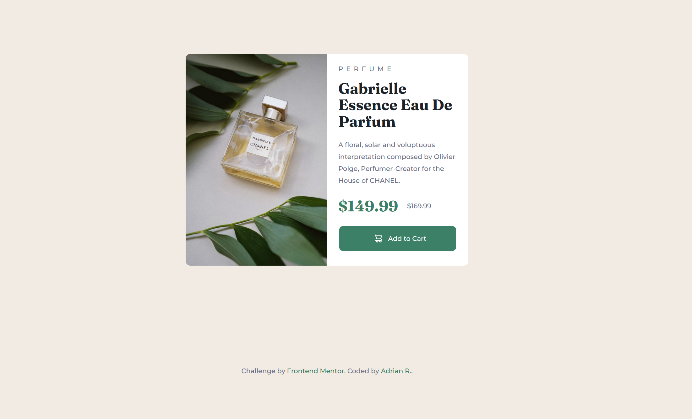

# Frontend Mentor - Product preview card component solution

This is a solution to the [Product preview card component challenge on Frontend Mentor](https://www.frontendmentor.io/challenges/product-preview-card-component-GO7UmttRfa). Frontend Mentor challenges help you improve your coding skills by building realistic projects.

## Table of contents

- [Overview](#overview)
  - [The challenge](#the-challenge)
  - [Screenshot](#screenshot)
  - [Links](#links)
- [My process](#my-process)
  - [Built with](#built-with)
  - [What I learned](#what-i-learned)
  - [Continued development](#continued-development)
  - [Useful resources](#useful-resources)
- [Author](#author)
- [Acknowledgments](#acknowledgments)

## Overview

### The challenge

Users should be able to:

- View the optimal layout depending on their device's screen size
- See hover and focus states for interactive elements

### Screenshot



### Links

- Solution URL: [Frontend Mentor]()
- Live Site URL: [Github Pages]()

## My process

### Built with

- Semantic HTML5 markup
- CSS custom properties
- Flexbox
- CSS Grid
- Mobile-first workflow

### What I learned

At first, I had no idea how to implement the product image and have it switch to image-product-desktop.jpg. I thought about using the background-image property with a div. However, I wasn't satisfied with that. After a google search, I came across the picture tag. The picture tag is very helpful whenever multiple images are displayed at specific widths. Since I was building the mobile version of the site first, I made image-product-mobile.jpg the default by placing it in an img tag and used the source tag to link to my image-product-desktop.jpg and set the media to min-width: 40rem, meaning the image would replace the default image when the screen size is above 640px.

(See below for my snippet)

```html
<picture>
  <source
    srcset="images/image-product-desktop.jpg"
    media="(min-width: 40rem)"
  />

  
</picture>
```

### Continued development

I will continue to grow comfortable with media queries, optimization, responsive designs, and expanding on accessibility in future projects.

Even though this challenge did not require JavaScript, I would like to learn JavaScript to complete advanced challenges and bring my personal projects to the next level.

### Useful resources

- [Kevin Powell](https://www.youtube.com/kepowob) - Kevin Powell’s videos are extremely helpful for any beginner like me. He has many videos dedicated to tutorials such as grids, flexboxes, and tricks/hacks. He taught me HTML5 landmarks, CUBE CSS methodology, and other tips and tricks. I recommend beginners watch his videos.

- [A Modern CSS Reset](https://piccalil.li/blog/a-modern-css-reset/) - I used this simple CSS reset at the beginning of my CSS by Andy Bell and recommended by Kevin Powell in many of his videos. Resets are very helpful in reducing any inconsistencies between browsers. However, it's not necessary.

## Author

- Github - [Adrian R.](https://github.com/adriarodr)
- Frontend Mentor - [Adrian R.](https://www.frontendmentor.io/profile/adriarodr)

## Acknowledgments

Thanks to Kevin Powell for his amazing videos that helped me understand media queries and grid boxes and showed a clever way to center objects using grid boxes and place-items: center.

Thanks to Andy Bell Modern CSS Reset, which I've used on multiple projects to help reduce inconsistencies between browsers.

## Note
This was originally on my personal account, but I decided to transfer it to my professional account.